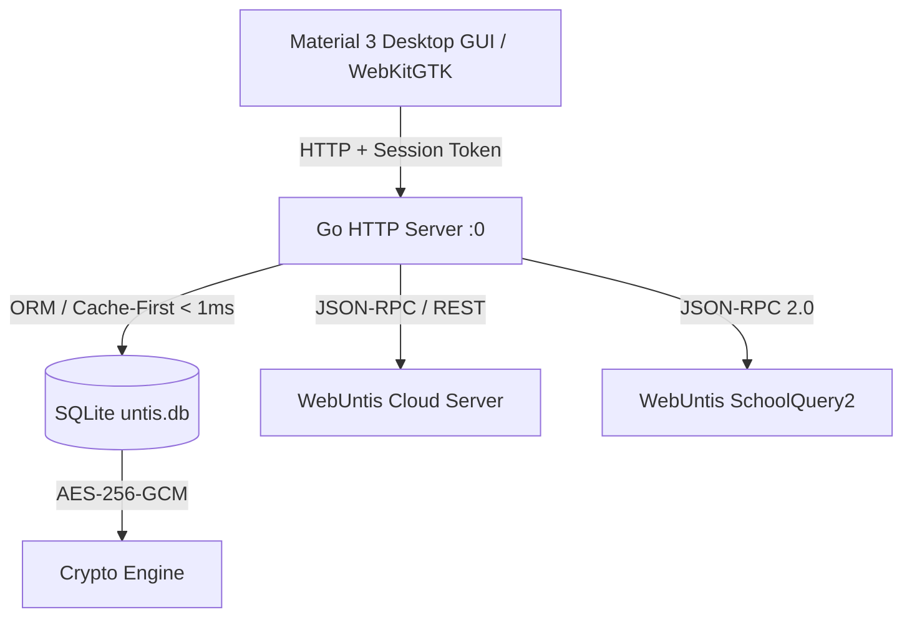

# Untis PC Remake (Go) · v1.0.0 🚀

[](https://github.com/)
[](https://opensource.org/licenses/MIT)
[](https://golang.org)
[](https://kernel.org)
[](https://en.wikipedia.org/wiki/Galois/Counter_Mode)

Das **ultimative Open-Source PC-Desktop-Remake für WebUntis** – entwickelt in modernem Go mit nativer WebKitGTK-Oberfläche, Hardware-Compositing und modernem **Material Design 3 Desktop UI** im unverwechselbaren Untis-Orange.

Keine gefälschten Mock- oder Demo-Daten: Direkte, hochperformante Anbindung an die echte WebUntis API und Schulsuche!

---

## 🌟 Highlights & Features

### 1. 🔍 Reine Schulsuche – Keine fest codierte Standardschule
- **Weltweite Live-Schulsuche**: Direkte Abfrage aller WebUntis-Schulen über `https://schoolsearch.webuntis.com/schoolquery2` (JSON-RPC 2.0 `searchSchool`).
- **Eleganter Onboarding-Screen**: Wenn noch kein Profil existiert, begrüßt die Anwendung den Nutzer mit einem Screen (*"Finde deine Schule"*).
- **1-Klick-Übernahme**: Bei Auswahl einer Schule werden Server-URL und Schulkürzel automatisch übernommen.
- **Unterstützung für Gast-/Anonym-Zugänge** oder vollwertige Schüler- und Lehrkraft-Logins.

### 2. 🖥️ Atemberaubende PC-Desktop-GUI (Material 3 Remake)
- **Top-App-Bar der Extraklasse**:
  - Offizielles Untis-Branding mit Schullogo und aktuellem Schulnamen.
  - **Profil-Schnellwechsler mit Avatar-Badge** (Initialen & 1-Klick-Umschaltung zwischen mehreren Profilen/Schulen).
  - **Klassen-Dropdown mit Live-Suchfilter** (Echtzeit-Filterung über hunderte Klassen).
  - **Ansichtsumschalter**: Nahtloser Wechsel zwischen **Tagesansicht** und **Wochenansicht**.
  - **Datumsleiste**: Vor-/Zurück-Blättern, Datumsauswahl per Kalender-Picker und direkter **„Heute“-Sprung**.
- **🔴 Live-Zeitlinie**:
  - Dynamische **rote Markierungslinie** im Stundenplan mit pulsierendem Punkt für die exakte aktuelle Uhrzeit.
- **Modernes Unterrichts-Info-Sheet**:
  - Klick auf eine Stunde öffnet ein detailliertes Sheet mit allen **Lehrkräften** (inkl. Vertretungsvergleich), **Räumen** (inkl. Raumänderungen), **Unterrichtsinhalten / Lehrstoff** und **Hausaufgaben**.
- **⌨️ PC-Tastaturkürzel**:
  - `←` / `→` : Vorheriger / Nächster Tag (bzw. Woche)
  - `T` : Zu Heute springen
  - `D` : Tagesansicht aktivieren
  - `W` : Wochenansicht aktivieren
  - `Esc` : Offene Dialoge, Info-Sheets und Menüs schließen

### 3. 🛡️ Maximale Sicherheit & Sandboxing
- **Dynamischer Random-Port**: Der interne Webserver bindet immer an einen dynamischen Zufallsport auf `127.0.0.1` (`127.0.0.1:0`).
- **32-Zeichen Krypto-Session-Token**: Bei jedem Start wird ein kryptografisches Session-Token mit `crypto/rand` generiert. Alle API-Endpunkte fordern dieses Token zwingend an (`X-Session-Token` oder `?token=...`). Unbefugte lokale Prozesse werden mit `401 Unauthorized` abgewiesen.
- **AES-256-GCM Datenbank-Verschlüsselung**:
  - SQLite-Datenbank unter `~/.local/share/untis-go/untis.db`.
  - Passwörter werden **niemals im Klartext** gespeichert, sondern mit **AES-256-GCM** und 12-Byte-Zufallsnonces verschlüsselt.
  - Multi-User-System mit Tabellen: `profiles`, `classes`, `timetable_cache`, `settings`.
  - **Einmalige Auto-Migration**: Bestehende Logins aus `~/.untis/data/credentials.json` und dem Linux-Schlüsselbund (`secret-tool`) werden beim ersten Start automatisch verschlüsselt in SQLite migriert.

### 4. ⚡ Zero-Lag & 60 FPS WebKit-Optimierung
- **Cache-First-Architektur**: Stundenpläne werden in **< 1 ms** direkt aus SQLite geliefert.
- **Asynchroner Hintergrund-Sync**: Stundenplan-Aktualisierungen erfolgen im Hintergrund ohne UI-Ruckeln.
- **Flüssige Darstellung auf Wayland/Linux**:
  - `WEBKIT_DISABLE_DMABUF_RENDERER=1` verhindert Flackern unter modernen Wayland-Compositoren.
  - Hardware-beschleunigtes Canvas und WebGL mit `WEBKIT_HARDWARE_ACCELERATION_POLICY_ALWAYS`.

---

## 🏛️ Architektur



### Projektstruktur

```
untis-go/
├── api/
│   └── untis.go          # WebUntis API Client (Spring Security, JWT Bearer, JSON-RPC, SchoolQuery2)
├── db/
│   ├── db.go             # SQLite Initialisierung, WAL-Modus & Pool
│   ├── crypto.go         # AES-256-GCM Ver- & Entschlüsselung
│   ├── models.go         # Datenstrukturen für Profile, Klassen & Timetable
│   ├── profiles.go       # Multi-Profile-Verwaltung
│   ├── classes.go        # Klassenliste & Caching
│   ├── timetable.go      # Stundenplan-Cache
│   ├── settings.go       # Key-Value Konfiguration
│   ├── migration.go      # Auto-Migration aus legacy JSON/credentials
│   └── db_test.go        # Unit-Tests für Krypto & DB
├── server/
│   ├── server.go         # HTTP Server, Token-Security-Middleware & REST API
│   └── server_test.go    # Integrationstests für Authentifizierung & Random-Port
├── web/
│   ├── embed.go          # Go embed.FS Einbettung aller Web-Assets
│   ├── index.html        # Material 3 Desktop HTML-Layout
│   ├── style.css         # Untis-Orange Styling, Dark/Light Mode, Desktop Tokens
│   └── app.js            # Desktop State-Management, Live-Timeline & Tastaturkürzel
├── gui.go                # WebKitGTK 4.1 CGo-Launcher mit 60 FPS Hardware-Compositing
├── main.go               # Anwendungs-Einstiegspunkt, CLI-Flags & Signalbehandlung
├── LICENSE               # Vollständige MIT-Lizenz (Jeremy Benz)
└── README.md             # Hochglanz-Dokumentation
```

---

## 🚀 Installation & Kompilierung

### Voraussetzungen (Linux)
Für das native WebKitGTK-Fenster werden folgende Systembibliotheken benötigt:
- `webkit2gtk-4.1` (oder `webkit2gtk-4.0`)
- `gtk+-3.0`
- `gcc` / CGo-Toolchain
- `libsecret` (optional, für Schlüsselbund-Import)

Unter Arch Linux / CachyOS / Manjaro:
```bash
sudo pacman -S webkit2gtk-4.1 gtk3 gcc libsecret
```

Unter Ubuntu / Debian:
```bash
sudo apt install libwebkit2gtk-4.1-dev libgtk-3-dev build-essential libsecret-tools
```

### Kompilieren
```bash
cd /home/benzj/untis-go
go build -o untis-go .
```

### Systemweite Installation
```bash
cp untis-go /usr/local/bin/untis-go
chmod +x /usr/local/bin/untis-go
```

---

## 📖 Benutzung

```bash
# 1. Normaler Desktop-Start (öffnet natives WebKitGTK-Fenster):
untis-go

# 2. Start im Standard-Webbrowser:
untis-go -browser

# 3. Headless Server-Modus ohne GUI (z. B. auf Port 8080):
untis-go -no-gui -port 8080
```

---

## ⌨️ Tastenkombinationen (Shortcuts)

| Taste | Aktion |
|---|---|
| `←` (Pfeil links) | Vorheriger Tag bzw. vorherige Woche |
| `→` (Pfeil rechts) | Nächster Tag bzw. nächste Woche |
| `T` | Zu **Heute** springen |
| `D` | **Tagesansicht** aktivieren |
| `W` | **Wochenansicht** aktivieren |
| `Esc` | Geöffnete Menüs, Info-Sheets und Einstellungen schließen |

---

## 🔒 Sicherheitskonzept

1. **Verschlüsselte Speicherung**:
   Passwörter werden niemals im Klartext gespeichert. Die Verschlüsselung erfolgt mit AES-256 im Galois/Counter Mode (GCM).
2. **Dynamischer Random-Port**:
   Es gibt keinen festen Port (wie 8080), der im Netzwerk ausgespäht werden könnte. Der Server bindet immer an `127.0.0.1:0`.
3. **Session-Token**:
   Jeder Start erzeugt ein kryptografisches Token. Alle REST-Endpunkte verifizieren dieses Token bei jedem Request.

---

## 📄 Lizenz

Dieses Projekt steht unter der **MIT-Lizenz**.  
Copyright (c) 2026 **Jeremy Benz**. Alle Rechte vorbehalten.  
Weitere Informationen finden sich in der [LICENSE](LICENSE)-Datei.
